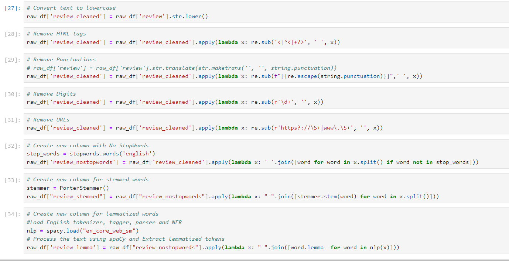
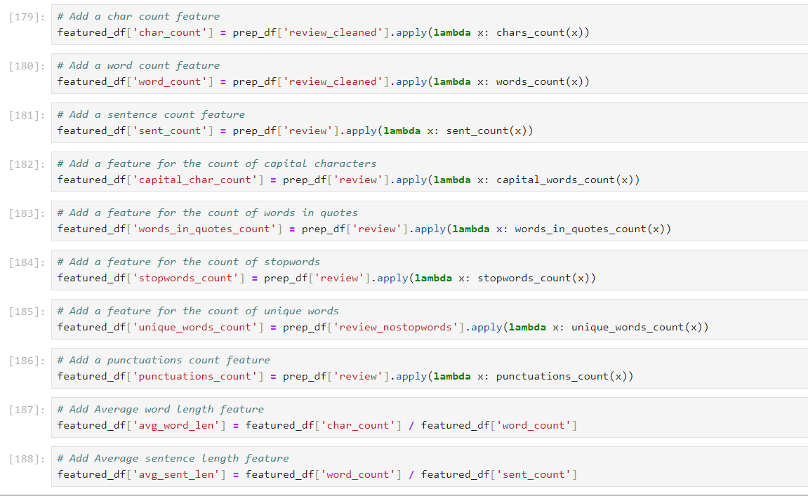
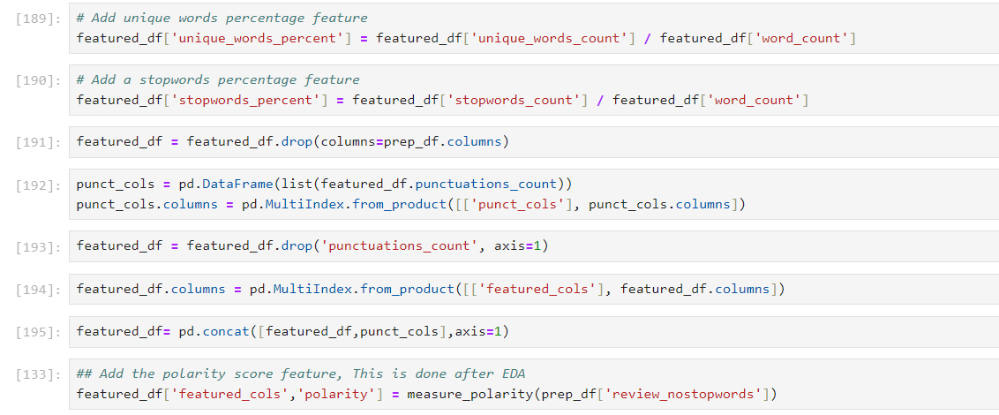
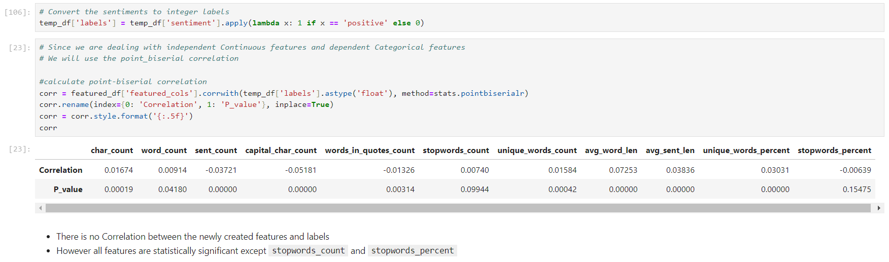
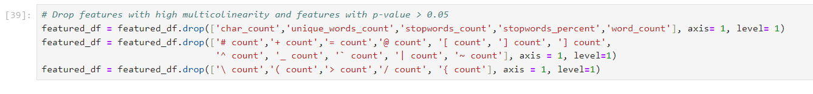

# IMDB Reviews Sentiment Analysis Project

## Frame the Problem
- This is an IMDB dataset having 50K movie reviews for natural language processing.
- It is a  binary sentiment classificatios.It consists ofaa  set of 25,000positive and 25,000 negative reviews..

## Objective
- The objective is to predict the number of positive and negative reviews using either classification or deep learning algorithms.

## Data Source
https://www.kaggle.com/datasets/lakshmi25npathi/imdb-dataset-of-50k-movie-reviews/data

## Data Understanding
- The Dataset consists of 50000 labeled reviews With no missing values and no duplicates.

- The Dataset is perfectly balanced with equal number of positive and negative reviews.

## Data Preprocessing

- Applied Text preprocessing to make the reviews ready for machine learning

## Feature Engineering

- Created new features that could increase the performance of our model

## Exploratory Data Analysis

- Correlation between sentiment and engineered features:

- Most common words and sentences in each review

# Feature Selection 

- Dropped Features with high multicolinearity and features with p-value < 0.05

# Model Building

- Tried different methods of text representation such as: Tf-IDF, Bag of Words and word2vec
- Tried different machine learning models such as: Logisitic Regression, Naive Bayes Classifier and Long short term memory
- Logistic Regression with Bigram Bag of words returned the highest accuracy of 90.08% and 0.91 F1 Score
